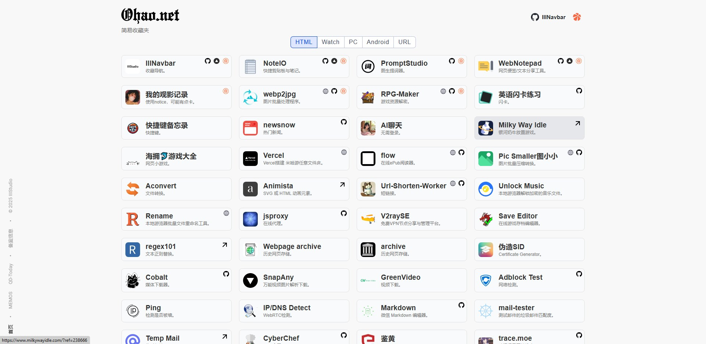

# IIINavbar 收藏或展示页
一个简单的收藏或展示页 演示：https://github.com/IIIStudio/IIINavbar

## 更新日志
- 2026年3月7日
 -  添加CNB手动触发流水线

- 2025年10月14日
    - 添加 搜索功能

## 使用方法

### CNB 手动触发流水线

点击执行 写入网站 

```bash
show_help() {
    echo "用法: $0 -add 类别 href img name jianjie top [图标URL ...]"
    echo ""
    echo "参数说明（前6个固定）:"
    echo "  类别      - JSON中的分类名，如 HTML, Watch, PC, URL 等"
    echo "  href      - 主URL地址"
    echo "  img       - 图片地址"
    echo "  name      - 项目名称"
    echo "  jianjie   - 项目简介"
    echo "  top       - 插入位置（数字），1表示第一个，0或留空表示追加到最后"
    echo ""
    echo "后面的参数（可选，可多个）:"
    echo "  图标URL - 例如 https://github.com/xxx 或 tg=https://t.me/xxx"
    echo ""
    echo "支持的图标类型: GitHub, GooglePlay, OneDrive, QQ, Python, tg, tui, vercel, gw, wenzhang"
    echo ""
    echo "格式支持:"
    echo "  1. 自动识别: https://github.com/xxx -> GitHub"
    echo "  2. 手动指定: tg=https://t.me/xxx"
    echo "  3. 简写支持: gi=https://github.com/xxx"
    echo ""
    echo "示例:"
    echo "  $0 -add URL \"https://app.alice.ws/compute\" \"https://pic2.ziyuan.wang/.../alice.png\" \"alice\" \"免费服务器。\" 1 tg=https://t.me/xxx https://github.com/xxx"
}
```
例如 
```bash
./IIINavbar.sh -add URL "https://app.alice.ws/compute" "https://pic2.ziyuan.wang/.../alice.png" "alice" "免费服务器。" 1 tg=https://t.me/xxx https://github.com/xxx
```
对应的参数为：
```
类别      - URL
href      - https://app.alice.ws/compute
img       - https://pic2.ziyuan.wang/.../alice.png
name      - alice
jianjie   - 免费服务器。
top       - 1
图标名称及链接地址   - tg=https://t.me/xxx https://github.com/xxx
```

### 删除网站

输入删除的网站名称

### 直接修改
修改icon.json文件，添加或删除icon

修改collect.json文件，添加或删除收藏地址

参数说明
```json
{
    "HTML": [
        {
            "href": "https://iii.ohao.net/",
            "img": "./image/IIIStudio.png",
            "nome": "IIINavbar",
            "jianjie": "收藏导航。",
            "GitHub": "https://github.com/IIIStudio/IIINavbar",
            "vercel": "https://vercel.com/import/project?template=https://github.com/IIIStudio/IIINavbar/tree/main",
            "tui": "https://iii.ohao.net/"
        },

```
### 主要参数：
`HTML`为的类别，
`href`为的地址，
`img`为的图标，
`nome`为的名称，
`jianjie`为的简介，

### icon参数：
这些是在icon.json中添加 例如：
```
    "vercel": {
        "class": "vercel-btn",
        "url": "./image/vercel.png",
        "height": 16
    },
```
`vercel`为的为变量，
`url`为的vercel图片地址，
`height`为图片大小，如果是长图，添加"ratio": 3.111

## 搭建

复刻 然后修改参数，然后添加 GitHub Pages 网站

Vercel一键部署:

<a href="https://vercel.com/import/project?template=https://github.com/IIIStudio/IIINavbar/tree/main"></a>

## 图片

