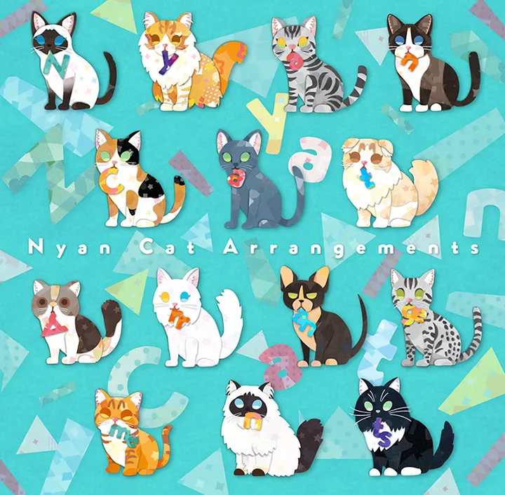
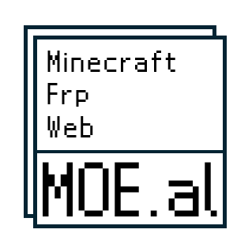
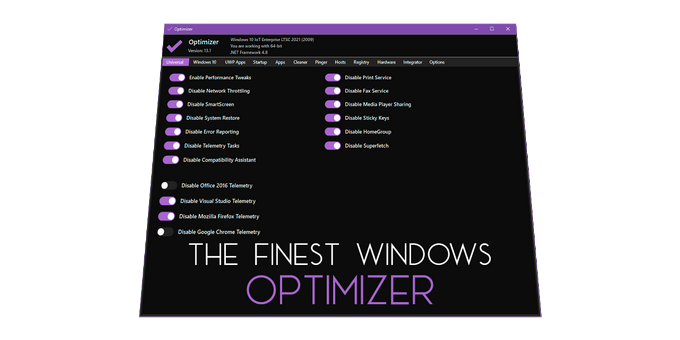

# 图片库

总计 294 张图片

## 当前目录

<table>
  <tr>
    <td align="center">
      <a href="./1.jpg" target="_blank">
         
      </a>
      1.jpg
    </td>
    <td align="center">
      <a href="./1DM.webp" target="_blank">
         
      </a>
      1DM.webp
    </td>
    <td align="center">
      <a href="./33tool.png" target="_blank">
         
      </a>
      33tool.png
    </td>
  </tr>
  <tr>
    <td align="center">
      <a href="./35photo.webp" target="_blank">
         
      </a>
      35photo.webp
    </td>
    <td align="center">
      <a href="./Aconvert.webp" target="_blank">
         
      </a>
      Aconvert.webp
    </td>
    <td align="center">
      <a href="./Adobe.png" target="_blank">
         
      </a>
      Adobe.png
    </td>
  </tr>
  <tr>
    <td align="center">
      <a href="./AirExplorer Pro.webp" target="_blank">
         
      </a>
      AirExplorer Pro.webp
    </td>
    <td align="center">
      <a href="./Animista.png" target="_blank">
         
      </a>
      Animista.png
    </td>
    <td align="center">
      <a href="./AriaNg.png" target="_blank">
         
      </a>
      AriaNg.png
    </td>
  </tr>
  <tr>
    <td align="center">
      <a href="./AssetStudio.png" target="_blank">
         
      </a>
      AssetStudio.png
    </td>
    <td align="center">
      <a href="./AutoJs6.png" target="_blank">
         
      </a>
      AutoJs6.png
    </td>
    <td align="center">
      <a href="./Azure TTS 文本转语音.png" target="_blank">
         
      </a>
      Azure TTS 文本转语音.png
    </td>
  </tr>
  <tr>
    <td align="center">
      <a href="./BGP.Tools.png" target="_blank">
         
      </a>
      BGP.Tools.png
    </td>
    <td align="center">
      <a href="./Bandicam.webp" target="_blank">
         
      </a>
      Bandicam.webp
    </td>
    <td align="center">
      <a href="./Be JSON.png" target="_blank">
         
      </a>
      Be JSON.png
    </td>
  </tr>
  <tr>
    <td align="center">
      <a href="./BlackBox.png" target="_blank">
         
      </a>
      BlackBox.png
    </td>
    <td align="center">
      <a href="./CSS Diner.jpg" target="_blank">
         
      </a>
      CSS Diner.jpg
    </td>
    <td align="center">
      <a href="./Cheat Engine.png" target="_blank">
         
      </a>
      Cheat Engine.png
    </td>
  </tr>
  <tr>
    <td align="center">
      <a href="./Cisco AnyConnect.webp" target="_blank">
         
      </a>
      Cisco AnyConnect.webp
    </td>
    <td align="center">
      <a href="./Clash.webp" target="_blank">
         
      </a>
      Clash.webp
    </td>
    <td align="center">
      <a href="./ClipboardFusion.webp" target="_blank">
         
      </a>
      ClipboardFusion.webp
    </td>
  </tr>
  <tr>
    <td align="center">
      <a href="./Cobalt 2.png" target="_blank">
         
      </a>
      Cobalt 2.png
    </td>
    <td align="center">
      <a href="./Cobalt.png" target="_blank">
         
      </a>
      Cobalt.png
    </td>
    <td align="center">
      <a href="./Collect UI.png" target="_blank">
         
      </a>
      Collect UI.png
    </td>
  </tr>
  <tr>
    <td align="center">
      <a href="./ConnectBot.webp" target="_blank">
         
      </a>
      ConnectBot.webp
    </td>
    <td align="center">
      <a href="./Copilot.png" target="_blank">
         
      </a>
      Copilot.png
    </td>
    <td align="center">
      <a href="./Copy, URL to Google Drive.png" target="_blank">
         
      </a>
      Copy, URL to Google Drive.png
    </td>
  </tr>
  <tr>
    <td align="center">
      <a href="./Copy-B.jpg" target="_blank">
         
      </a>
      Copy-B.jpg
    </td>
    <td align="center">
      <a href="./Cotrans.jpg" target="_blank">
         
      </a>
      Cotrans.jpg
    </td>
    <td align="center">
      <a href="./CyberChef.png" target="_blank">
         
      </a>
      CyberChef.png
    </td>
  </tr>
  <tr>
    <td align="center">
      <a href="./DeepSeek.png" target="_blank">
         
      </a>
      DeepSeek.png
    </td>
    <td align="center">
      <a href="./F-Droid.png" target="_blank">
         
      </a>
      F-Droid.png
    </td>
    <td align="center">
      <a href="./Fiddler.png" target="_blank">
         
      </a>
      Fiddler.png
    </td>
  </tr>
  <tr>
    <td align="center">
      <a href="./FluentTerminal.png" target="_blank">
         
      </a>
      FluentTerminal.png
    </td>
    <td align="center">
      <a href="./Follow.png" target="_blank">
         
      </a>
      Follow.png
    </td>
    <td align="center">
      <a href="./Font Meme.png" target="_blank">
         
      </a>
      Font Meme.png
    </td>
  </tr>
  <tr>
    <td align="center">
      <a href="./GARbro.jpg" target="_blank">
         
      </a>
      GARbro.jpg
    </td>
    <td align="center">
      <a href="./GitHub.png" target="_blank">
         
      </a>
      GitHub.png
    </td>
    <td align="center">
      <a href="./Glarity.png" target="_blank">
         
      </a>
      Glarity.png
    </td>
  </tr>
  <tr>
    <td align="center">
      <a href="./GooglePlay-icon.png" target="_blank">
         
      </a>
      GooglePlay-icon.png
    </td>
    <td align="center">
      <a href="./GooglePlay.png" target="_blank">
         
      </a>
      GooglePlay.png
    </td>
    <td align="center">
      <a href="./GreenVideo - 2.png" target="_blank">
         
      </a>
      GreenVideo - 2.png
    </td>
  </tr>
  <tr>
    <td align="center">
      <a href="./GreenVideo.png" target="_blank">
         
      </a>
      GreenVideo.png
    </td>
    <td align="center">
      <a href="./HexEd.it.png" target="_blank">
         
      </a>
      HexEd.it.png
    </td>
    <td align="center">
      <a href="./Hitomi-Downloader.png" target="_blank">
         
      </a>
      Hitomi-Downloader.png
    </td>
  </tr>
  <tr>
    <td align="center">
      <a href="./Httpcanary.png" target="_blank">
         
      </a>
      Httpcanary.png
    </td>
    <td align="center">
      <a href="./IBM.png" target="_blank">
         
      </a>
      IBM.png
    </td>
    <td align="center">
      <a href="./IIIStudio.png" target="_blank">
         
      </a>
      IIIStudio.png
    </td>
  </tr>
  <tr>
    <td align="center">
      <a href="./ITDOG.jpg" target="_blank">
         
      </a>
      ITDOG.jpg
    </td>
    <td align="center">
      <a href="./Icons8.png" target="_blank">
         
      </a>
      Icons8.png
    </td>
    <td align="center">
      <a href="./ImageGlass.png" target="_blank">
         
      </a>
      ImageGlass.png
    </td>
  </tr>
  <tr>
    <td align="center">
      <a href="./J2meJS.webp" target="_blank">
         
      </a>
      J2meJS.webp
    </td>
    <td align="center">
      <a href="./Kiwi Browser.webp" target="_blank">
         
      </a>
      Kiwi Browser.webp
    </td>
    <td align="center">
      <a href="./Live.png" target="_blank">
         
      </a>
      Live.png
    </td>
  </tr>
  <tr>
    <td align="center">
      <a href="./Loop.png" target="_blank">
         
      </a>
      Loop.png
    </td>
    <td align="center">
      <a href="./LottieFiles.png" target="_blank">
         
      </a>
      LottieFiles.png
    </td>
    <td align="center">
      <a href="./MTCGAME.png" target="_blank">
         
      </a>
      MTCGAME.png
    </td>
  </tr>
  <tr>
    <td align="center">
      <a href="./Magisk.png" target="_blank">
         
      </a>
      Magisk.png
    </td>
    <td align="center">
      <a href="./Memo Card.png" target="_blank">
         
      </a>
      Memo Card.png
    </td>
    <td align="center">
      <a href="./MicrosoftEntra.png" target="_blank">
         
      </a>
      MicrosoftEntra.png
    </td>
  </tr>
  <tr>
    <td align="center">
      <a href="./Microsoft_365.png" target="_blank">
         
      </a>
      Microsoft_365.png
    </td>
    <td align="center">
      <a href="./MixFile.png" target="_blank">
         
      </a>
      MixFile.png
    </td>
    <td align="center">
      <a href="./MoeKoeMusic.png" target="_blank">
         
      </a>
      MoeKoeMusic.png
    </td>
  </tr>
  <tr>
    <td align="center">
      <a href="./NMM File Manager.webp" target="_blank">
         
      </a>
      NMM File Manager.webp
    </td>
    <td align="center">
      <a href="./Namsogen.png" target="_blank">
         
      </a>
      Namsogen.png
    </td>
    <td align="center">
      <a href="./Neal.fun.webp" target="_blank">
         
      </a>
      Neal.fun.webp
    </td>
  </tr>
  <tr>
    <td align="center">
      <a href="./NekoBox for Android.jpg" target="_blank">
         
      </a>
      NekoBox for Android.jpg
    </td>
    <td align="center">
      <a href="./NekoBox for Android.webp" target="_blank">
         
      </a>
      NekoBox for Android.webp
    </td>
    <td align="center">
      <a href="./NetLimiter.png" target="_blank">
         
      </a>
      NetLimiter.png
    </td>
  </tr>
  <tr>
    <td align="center">
      <a href="./NetworkPanel.png" target="_blank">
         
      </a>
      NetworkPanel.png
    </td>
    <td align="center">
      <a href="./OneDrive-icon.png" target="_blank">
         
      </a>
      OneDrive-icon.png
    </td>
    <td align="center">
      <a href="./OneManager-php.png" target="_blank">
         
      </a>
      OneManager-php.png
    </td>
  </tr>
  <tr>
    <td align="center">
      <a href="./OpenCut.png" target="_blank">
         
      </a>
      OpenCut.png
    </td>
    <td align="center">
      <a href="./OpenPromptStudio.png" target="_blank">
         
      </a>
      OpenPromptStudio.png
    </td>
    <td align="center">
      <a href="./Oracle.png" target="_blank">
         
      </a>
      Oracle.png
    </td>
  </tr>
  <tr>
    <td align="center">
      <a href="./PageSpeed Insights.png" target="_blank">
         
      </a>
      PageSpeed Insights.png
    </td>
    <td align="center">
      <a href="./PanSearch.png" target="_blank">
         
      </a>
      PanSearch.png
    </td>
    <td align="center">
      <a href="./PaperkiteBT.jpg" target="_blank">
         
      </a>
      PaperkiteBT.jpg
    </td>
  </tr>
  <tr>
    <td align="center">
      <a href="./Pexels.webp" target="_blank">
         
      </a>
      Pexels.webp
    </td>
    <td align="center">
      <a href="./Pimeyes.webp" target="_blank">
         
      </a>
      Pimeyes.webp
    </td>
    <td align="center">
      <a href="./Pixiv.jpg" target="_blank">
         
      </a>
      Pixiv.jpg
    </td>
  </tr>
  <tr>
    <td align="center">
      <a href="./Plati.Market.png" target="_blank">
         
      </a>
      Plati.Market.png
    </td>
    <td align="center">
      <a href="./Polymarket.png" target="_blank">
         
      </a>
      Polymarket.png
    </td>
    <td align="center">
      <a href="./PotPlayer.png" target="_blank">
         
      </a>
      PotPlayer.png
    </td>
  </tr>
  <tr>
    <td align="center">
      <a href="./Power BI.png" target="_blank">
         
      </a>
      Power BI.png
    </td>
    <td align="center">
      <a href="./Privacy.png" target="_blank">
         
      </a>
      Privacy.png
    </td>
    <td align="center">
      <a href="./Pydroid 3.webp" target="_blank">
         
      </a>
      Pydroid 3.webp
    </td>
  </tr>
  <tr>
    <td align="center">
      <a href="./Python-icon.png" target="_blank">
         
      </a>
      Python-icon.png
    </td>
    <td align="center">
      <a href="./QD for Python3.png" target="_blank">
         
      </a>
      QD for Python3.png
    </td>
    <td align="center">
      <a href="./QQ-icon.png" target="_blank">
         
      </a>
      QQ-icon.png
    </td>
  </tr>
  <tr>
    <td align="center">
      <a href="./QQ.png" target="_blank">
         
      </a>
      QQ.png
    </td>
    <td align="center">
      <a href="./QQ群.png" target="_blank">
         
      </a>
      QQ群.png
    </td>
    <td align="center">
      <a href="./Quantumul.webp" target="_blank">
         
      </a>
      Quantumul.webp
    </td>
  </tr>
  <tr>
    <td align="center">
      <a href="./ReadCat.png" target="_blank">
         
      </a>
      ReadCat.png
    </td>
    <td align="center">
      <a href="./Real-ESRGAN.png" target="_blank">
         
      </a>
      Real-ESRGAN.png
    </td>
    <td align="center">
      <a href="./Ren'Py.png" target="_blank">
         
      </a>
      Ren'Py.png
    </td>
  </tr>
  <tr>
    <td align="center">
      <a href="./RevokeMsgPatcher.png" target="_blank">
         
      </a>
      RevokeMsgPatcher.png
    </td>
    <td align="center">
      <a href="./SMS-Activate.png" target="_blank">
         
      </a>
      SMS-Activate.png
    </td>
    <td align="center">
      <a href="./Save Editor.png" target="_blank">
         
      </a>
      Save Editor.png
    </td>
  </tr>
  <tr>
    <td align="center">
      <a href="./ScreenToGif.png" target="_blank">
         
      </a>
      ScreenToGif.png
    </td>
    <td align="center">
      <a href="./ShareX.png" target="_blank">
         
      </a>
      ShareX.png
    </td>
    <td align="center">
      <a href="./Signal.webp" target="_blank">
         
      </a>
      Signal.webp
    </td>
  </tr>
  <tr>
    <td align="center">
      <a href="./SteamDB.webp" target="_blank">
         
      </a>
      SteamDB.webp
    </td>
    <td align="center">
      <a href="./SteamTools.png" target="_blank">
         
      </a>
      SteamTools.png
    </td>
    <td align="center">
      <a href="./Store.png" target="_blank">
         
      </a>
      Store.png
    </td>
  </tr>
  <tr>
    <td align="center">
      <a href="./Tampermonkey.png" target="_blank">
         
      </a>
      Tampermonkey.png
    </td>
    <td align="center">
      <a href="./TeamDrive Generator.png" target="_blank">
         
      </a>
      TeamDrive Generator.png
    </td>
    <td align="center">
      <a href="./Terminus Player.png" target="_blank">
         
      </a>
      Terminus Player.png
    </td>
  </tr>
  <tr>
    <td align="center">
      <a href="./Termux.webp" target="_blank">
         
      </a>
      Termux.webp
    </td>
    <td align="center">
      <a href="./TierMaker.png" target="_blank">
         
      </a>
      TierMaker.png
    </td>
    <td align="center">
      <a href="./Tor 浏览器.png" target="_blank">
         
      </a>
      Tor 浏览器.png
    </td>
  </tr>
  <tr>
    <td align="center">
      <a href="./TrafficMonitor.webp" target="_blank">
         
      </a>
      TrafficMonitor.webp
    </td>
    <td align="center">
      <a href="./Twitter.png" target="_blank">
         
      </a>
      Twitter.png
    </td>
    <td align="center">
      <a href="./UABE.png" target="_blank">
         
      </a>
      UABE.png
    </td>
  </tr>
  <tr>
    <td align="center">
      <a href="./Url-Shorten-Worker.png" target="_blank">
         
      </a>
      Url-Shorten-Worker.png
    </td>
    <td align="center">
      <a href="./V2raySE.png" target="_blank">
         
      </a>
      V2raySE.png
    </td>
    <td align="center">
      <a href="./VR Media.webp" target="_blank">
         
      </a>
      VR Media.webp
    </td>
  </tr>
  <tr>
    <td align="center">
      <a href="./Vercel.jpg" target="_blank">
         
      </a>
      Vercel.jpg
    </td>
    <td align="center">
      <a href="./WebNotepad.png" target="_blank">
         
      </a>
      WebNotepad.png
    </td>
    <td align="center">
      <a href="./Webpage archive.png" target="_blank">
         
      </a>
      Webpage archive.png
    </td>
  </tr>
  <tr>
    <td align="center">
      <a href="./XHS-Downloader.png" target="_blank">
         
      </a>
      XHS-Downloader.png
    </td>
    <td align="center">
      <a href="./YOURLS.png" target="_blank">
         
      </a>
      YOURLS.png
    </td>
    <td align="center">
      <a href="./Yande.re.jpg" target="_blank">
         
      </a>
      Yande.re.jpg
    </td>
  </tr>
  <tr>
    <td align="center">
      <a href="./YesPlayMusic.png" target="_blank">
         
      </a>
      YesPlayMusic.png
    </td>
    <td align="center">
      <a href="./Z-Library.webp" target="_blank">
         
      </a>
      Z-Library.webp
    </td>
    <td align="center">
      <a href="./ZArchiver.webp" target="_blank">
         
      </a>
      ZArchiver.webp
    </td>
  </tr>
  <tr>
    <td align="center">
      <a href="./adobe_illustrator.png" target="_blank">
         
      </a>
      adobe_illustrator.png
    </td>
    <td align="center">
      <a href="./adobe_photoshop.png" target="_blank">
         
      </a>
      adobe_photoshop.png
    </td>
    <td align="center">
      <a href="./alice.png" target="_blank">
         
      </a>
      alice.png
    </td>
  </tr>
  <tr>
    <td align="center">
      <a href="./alist.png" target="_blank">
         
      </a>
      alist.png
    </td>
    <td align="center">
      <a href="./annet.webp" target="_blank">
         
      </a>
      annet.webp
    </td>
    <td align="center">
      <a href="./api.aa1.cn.png" target="_blank">
         
      </a>
      api.aa1.cn.png
    </td>
  </tr>
  <tr>
    <td align="center">
      <a href="./arealme.png" target="_blank">
         
      </a>
      arealme.png
    </td>
    <td align="center">
      <a href="./autohotkey.png" target="_blank">
         
      </a>
      autohotkey.png
    </td>
    <td align="center">
      <a href="./avataaars.png" target="_blank">
         
      </a>
      avataaars.png
    </td>
  </tr>
  <tr>
    <td align="center">
      <a href="./avatar.webp" target="_blank">
         
      </a>
      avatar.webp
    </td>
    <td align="center">
      <a href="./awesome-selfhosted.png" target="_blank">
         
      </a>
      awesome-selfhosted.png
    </td>
    <td align="center">
      <a href="./azure.png" target="_blank">
         
      </a>
      azure.png
    </td>
  </tr>
  <tr>
    <td align="center">
      <a href="./bat.png" target="_blank">
         
      </a>
      bat.png
    </td>
    <td align="center">
      <a href="./bezier.method.ac.jpg" target="_blank">
         
      </a>
      bezier.method.ac.jpg
    </td>
    <td align="center">
      <a href="./bilibili.png" target="_blank">
         
      </a>
      bilibili.png
    </td>
  </tr>
  <tr>
    <td align="center">
      <a href="./bt.pyth.onl.png" target="_blank">
         
      </a>
      bt.pyth.onl.png
    </td>
    <td align="center">
      <a href="./bttwoo.png" target="_blank">
         
      </a>
      bttwoo.png
    </td>
    <td align="center">
      <a href="./c.png" target="_blank">
         
      </a>
      c.png
    </td>
  </tr>
  <tr>
    <td align="center">
      <a href="./chatgpt-mirai-qq-bot.png" target="_blank">
         
      </a>
      chatgpt-mirai-qq-bot.png
    </td>
    <td align="center">
      <a href="./chatgpt.png" target="_blank">
         
      </a>
      chatgpt.png
    </td>
    <td align="center">
      <a href="./claude.png" target="_blank">
         
      </a>
      claude.png
    </td>
  </tr>
  <tr>
    <td align="center">
      <a href="./cloud_storage-32.png" target="_blank">
         
      </a>
      cloud_storage-32.png
    </td>
    <td align="center">
      <a href="./console.run.claw.cloud.png" target="_blank">
         
      </a>
      console.run.claw.cloud.png
    </td>
    <td align="center">
      <a href="./d3ward.github.io.png" target="_blank">
         
      </a>
      d3ward.github.io.png
    </td>
  </tr>
  <tr>
    <td align="center">
      <a href="./dnSpy.webp" target="_blank">
         
      </a>
      dnSpy.webp
    </td>
    <td align="center">
      <a href="./dribbble.png" target="_blank">
         
      </a>
      dribbble.png
    </td>
    <td align="center">
      <a href="./edu.webp" target="_blank">
         
      </a>
      edu.webp
    </td>
  </tr>
  <tr>
    <td align="center">
      <a href="./elepub.png" target="_blank">
         
      </a>
      elepub.png
    </td>
    <td align="center">
      <a href="./emeditor.png" target="_blank">
         
      </a>
      emeditor.png
    </td>
    <td align="center">
      <a href="./ezgif.com.png" target="_blank">
         
      </a>
      ezgif.com.png
    </td>
  </tr>
  <tr>
    <td align="center">
      <a href="./files.gallery.png" target="_blank">
         
      </a>
      files.gallery.png
    </td>
    <td align="center">
      <a href="./fitgirl-repacks.site.jpg" target="_blank">
         
      </a>
      fitgirl-repacks.site.jpg
    </td>
    <td align="center">
      <a href="./flow.png" target="_blank">
         
      </a>
      flow.png
    </td>
  </tr>
  <tr>
    <td align="center">
      <a href="./freepnglogos.com.png" target="_blank">
         
      </a>
      freepnglogos.com.png
    </td>
    <td align="center">
      <a href="./freshrss.png" target="_blank">
         
      </a>
      freshrss.png
    </td>
    <td align="center">
      <a href="./gallery-dl.png" target="_blank">
         
      </a>
      gallery-dl.png
    </td>
  </tr>
  <tr>
    <td align="center">
      <a href="./game.haiyong.site.gif" target="_blank">
         
      </a>
      game.haiyong.site.gif
    </td>
    <td align="center">
      <a href="./geek-uninstaller-boxshot.png" target="_blank">
         
      </a>
      geek-uninstaller-boxshot.png
    </td>
    <td align="center">
      <a href="./genspark.ai.png" target="_blank">
         
      </a>
      genspark.ai.png
    </td>
  </tr>
  <tr>
    <td align="center">
      <a href="./gitbook.png" target="_blank">
         
      </a>
      gitbook.png
    </td>
    <td align="center">
      <a href="./go.webp" target="_blank">
         
      </a>
      go.webp
    </td>
    <td align="center">
      <a href="./google_play.png" target="_blank">
         
      </a>
      google_play.png
    </td>
  </tr>
  <tr>
    <td align="center">
      <a href="./gw-icon.png" target="_blank">
         
      </a>
      gw-icon.png
    </td>
    <td align="center">
      <a href="./hifini.png" target="_blank">
         
      </a>
      hifini.png
    </td>
    <td align="center">
      <a href="./history.jailhouselawyers.org.png" target="_blank">
         
      </a>
      history.jailhouselawyers.org.png
    </td>
  </tr>
  <tr>
    <td align="center">
      <a href="./humanbenchmark.com.png" target="_blank">
         
      </a>
      humanbenchmark.com.png
    </td>
    <td align="center">
      <a href="./huorong.png" target="_blank">
         
      </a>
      huorong.png
    </td>
    <td align="center">
      <a href="./icon-AppleiTunes.png" target="_blank">
         
      </a>
      icon-AppleiTunes.png
    </td>
  </tr>
  <tr>
    <td align="center">
      <a href="./iconify.png" target="_blank">
         
      </a>
      iconify.png
    </td>
    <td align="center">
      <a href="./ip.png" target="_blank">
         
      </a>
      ip.png
    </td>
    <td align="center">
      <a href="./ipleak.net.png" target="_blank">
         
      </a>
      ipleak.net.png
    </td>
  </tr>
  <tr>
    <td align="center">
      <a href="./it-tools.png" target="_blank">
         
      </a>
      it-tools.png
    </td>
    <td align="center">
      <a href="./itchio.png" target="_blank">
         
      </a>
      itchio.png
    </td>
    <td align="center">
      <a href="./jacket.webp" target="_blank">
         
      </a>
      jacket.webp
    </td>
  </tr>
  <tr>
    <td align="center">
      <a href="./jsproxy.jpg" target="_blank">
         
      </a>
      jsproxy.jpg
    </td>
    <td align="center">
      <a href="./komiic.com - 2.png" target="_blank">
         
      </a>
      komiic.com - 2.png
    </td>
    <td align="center">
      <a href="./komiic.com.png" target="_blank">
         
      </a>
      komiic.com.png
    </td>
  </tr>
  <tr>
    <td align="center">
      <a href="./koyso.png" target="_blank">
         
      </a>
      koyso.png
    </td>
    <td align="center">
      <a href="./linglong.png" target="_blank">
         
      </a>
      linglong.png
    </td>
    <td align="center">
      <a href="./lz.qaiu.top.png" target="_blank">
         
      </a>
      lz.qaiu.top.png
    </td>
  </tr>
  <tr>
    <td align="center">
      <a href="./mail-tester.com.png" target="_blank">
         
      </a>
      mail-tester.com.png
    </td>
    <td align="center">
      <a href="./mangareader.to.gif" target="_blank">
         
      </a>
      mangareader.to.gif
    </td>
    <td align="center">
      <a href="./mefo.cc.png" target="_blank">
         
      </a>
      mefo.cc.png
    </td>
  </tr>
  <tr>
    <td align="center">
      <a href="./memos.png" target="_blank">
         
      </a>
      memos.png
    </td>
    <td align="center">
      <a href="./microsoft-color.png" target="_blank">
         
      </a>
      microsoft-color.png
    </td>
    <td align="center">
      <a href="./microsoft.png" target="_blank">
         
      </a>
      microsoft.png
    </td>
  </tr>
  <tr>
    <td align="center">
      <a href="./mihomo-party.png" target="_blank">
         
      </a>
      mihomo-party.png
    </td>
    <td align="center">
      <a href="./milkywayidle.png" target="_blank">
         
      </a>
      milkywayidle.png
    </td>
    <td align="center">
      <a href="./moe.al.png" target="_blank">
         
      </a>
      moe.al.png
    </td>
  </tr>
  <tr>
    <td align="center">
      <a href="./ncase.me.png" target="_blank">
         
      </a>
      ncase.me.png
    </td>
    <td align="center">
      <a href="./nicebowl.fun.png" target="_blank">
         
      </a>
      nicebowl.fun.png
    </td>
    <td align="center">
      <a href="./notes.png" target="_blank">
         
      </a>
      notes.png
    </td>
  </tr>
  <tr>
    <td align="center">
      <a href="./office-365.png" target="_blank">
         
      </a>
      office-365.png
    </td>
    <td align="center">
      <a href="./onedrive.png" target="_blank">
         
      </a>
      onedrive.png
    </td>
    <td align="center">
      <a href="./oosu10.png" target="_blank">
         
      </a>
      oosu10.png
    </td>
  </tr>
  <tr>
    <td align="center">
      <a href="./openrouter.png" target="_blank">
         
      </a>
      openrouter.png
    </td>
    <td align="center">
      <a href="./optimizer.png" target="_blank">
         
      </a>
      optimizer.png
    </td>
    <td align="center">
      <a href="./pinterest.png" target="_blank">
         
      </a>
      pinterest.png
    </td>
  </tr>
  <tr>
    <td align="center">
      <a href="./power-automate.png" target="_blank">
         
      </a>
      power-automate.png
    </td>
    <td align="center">
      <a href="./pyVideoTrans.png" target="_blank">
         
      </a>
      pyVideoTrans.png
    </td>
    <td align="center">
      <a href="./python.png" target="_blank">
         
      </a>
      python.png
    </td>
  </tr>
  <tr>
    <td align="center">
      <a href="./qbittorrent.png" target="_blank">
         
      </a>
      qbittorrent.png
    </td>
    <td align="center">
      <a href="./rargb.png" target="_blank">
         
      </a>
      rargb.png
    </td>
    <td align="center">
      <a href="./rargb.to.png" target="_blank">
         
      </a>
      rargb.to.png
    </td>
  </tr>
  <tr>
    <td align="center">
      <a href="./rclone.png" target="_blank">
         
      </a>
      rclone.png
    </td>
    <td align="center">
      <a href="./regex101.png" target="_blank">
         
      </a>
      regex101.png
    </td>
    <td align="center">
      <a href="./renpy.png" target="_blank">
         
      </a>
      renpy.png
    </td>
  </tr>
  <tr>
    <td align="center">
      <a href="./search.censys.io.png" target="_blank">
         
      </a>
      search.censys.io.png
    </td>
    <td align="center">
      <a href="./shadowsocks.png" target="_blank">
         
      </a>
      shadowsocks.png
    </td>
    <td align="center">
      <a href="./sharepoint.png" target="_blank">
         
      </a>
      sharepoint.png
    </td>
  </tr>
  <tr>
    <td align="center">
      <a href="./shields.io.png" target="_blank">
         
      </a>
      shields.io.png
    </td>
    <td align="center">
      <a href="./shotcut.png" target="_blank">
         
      </a>
      shotcut.png
    </td>
    <td align="center">
      <a href="./speedtest.png" target="_blank">
         
      </a>
      speedtest.png
    </td>
  </tr>
  <tr>
    <td align="center">
      <a href="./store.rg-adguard.net.png" target="_blank">
         
      </a>
      store.rg-adguard.net.png
    </td>
    <td align="center">
      <a href="./svgtopng.com.png" target="_blank">
         
      </a>
      svgtopng.com.png
    </td>
    <td align="center">
      <a href="./tdl.png" target="_blank">
         
      </a>
      tdl.png
    </td>
  </tr>
  <tr>
    <td align="center">
      <a href="./telegram.png" target="_blank">
         
      </a>
      telegram.png
    </td>
    <td align="center">
      <a href="./test.jpg" target="_blank">
         
      </a>
      test.jpg
    </td>
    <td align="center">
      <a href="./tg-icon.png" target="_blank">
         
      </a>
      tg-icon.png
    </td>
  </tr>
  <tr>
    <td align="center">
      <a href="./tui-icon.png" target="_blank">
         
      </a>
      tui-icon.png
    </td>
    <td align="center">
      <a href="./tv.png" target="_blank">
         
      </a>
      tv.png
    </td>
    <td align="center">
      <a href="./uBlock Origin.png" target="_blank">
         
      </a>
      uBlock Origin.png
    </td>
  </tr>
  <tr>
    <td align="center">
      <a href="./vercel.png" target="_blank">
         
      </a>
      vercel.png
    </td>
    <td align="center">
      <a href="./waifu2x-caffe.png" target="_blank">
         
      </a>
      waifu2x-caffe.png
    </td>
    <td align="center">
      <a href="./wallhere.png" target="_blank">
         
      </a>
      wallhere.png
    </td>
  </tr>
  <tr>
    <td align="center">
      <a href="./web.png" target="_blank">
         
      </a>
      web.png
    </td>
    <td align="center">
      <a href="./webp2jpg.png" target="_blank">
         
      </a>
      webp2jpg.png
    </td>
    <td align="center">
      <a href="./www.4kvm.tv.png" target="_blank">
         
      </a>
      www.4kvm.tv.png
    </td>
  </tr>
  <tr>
    <td align="center">
      <a href="./www.aolifu.org.jpg" target="_blank">
         
      </a>
      www.aolifu.org.jpg
    </td>
    <td align="center">
      <a href="./www.artstation.com.png" target="_blank">
         
      </a>
      www.artstation.com.png
    </td>
    <td align="center">
      <a href="./www.awwwards.com.jpg" target="_blank">
         
      </a>
      www.awwwards.com.jpg
    </td>
  </tr>
  <tr>
    <td align="center">
      <a href="./www.dqsj.top.png" target="_blank">
         
      </a>
      www.dqsj.top.png
    </td>
    <td align="center">
      <a href="./www.feijiji.com.png" target="_blank">
         
      </a>
      www.feijiji.com.png
    </td>
    <td align="center">
      <a href="./www.gequbao.com.png" target="_blank">
         
      </a>
      www.gequbao.com.png
    </td>
  </tr>
  <tr>
    <td align="center">
      <a href="./xftp.png" target="_blank">
         
      </a>
      xftp.png
    </td>
    <td align="center">
      <a href="./xgzb.top.png" target="_blank">
         
      </a>
      xgzb.top.png
    </td>
    <td align="center">
      <a href="./xi-xu.me.png" target="_blank">
         
      </a>
      xi-xu.me.png
    </td>
  </tr>
  <tr>
    <td align="center">
      <a href="./xmanhua.com.png" target="_blank">
         
      </a>
      xmanhua.com.png
    </td>
    <td align="center">
      <a href="./xshell.png" target="_blank">
         
      </a>
      xshell.png
    </td>
    <td align="center">
      <a href="./zero搬运网.png" target="_blank">
         
      </a>
      zero搬运网.png
    </td>
  </tr>
  <tr>
    <td align="center">
      <a href="./zfile2.png" target="_blank">
         
      </a>
      zfile2.png
    </td>
    <td align="center">
      <a href="./低端影视.png" target="_blank">
         
      </a>
      低端影视.png
    </td>
    <td align="center">
      <a href="./剪贴板.png" target="_blank">
         
      </a>
      剪贴板.png
    </td>
  </tr>
  <tr>
    <td align="center">
      <a href="./动漫之家.webp" target="_blank">
         
      </a>
      动漫之家.webp
    </td>
    <td align="center">
      <a href="./哔咔漫画下载器.png" target="_blank">
         
      </a>
      哔咔漫画下载器.png
    </td>
    <td align="center">
      <a href="./哪吒监控.png" target="_blank">
         
      </a>
      哪吒监控.png
    </td>
  </tr>
  <tr>
    <td align="center">
      <a href="./嗨正则.png" target="_blank">
         
      </a>
      嗨正则.png
    </td>
    <td align="center">
      <a href="./团子翻译器.jpg" target="_blank">
         
      </a>
      团子翻译器.jpg
    </td>
    <td align="center">
      <a href="./图压.png" target="_blank">
         
      </a>
      图压.png
    </td>
  </tr>
  <tr>
    <td align="center">
      <a href="./图床管理.png" target="_blank">
         
      </a>
      图床管理.png
    </td>
    <td align="center">
      <a href="./天翼小站.jpg" target="_blank">
         
      </a>
      天翼小站.jpg
    </td>
    <td align="center">
      <a href="./安娜的档案.png" target="_blank">
         
      </a>
      安娜的档案.png
    </td>
  </tr>
  <tr>
    <td align="center">
      <a href="./官方授权.png" target="_blank">
         
      </a>
      官方授权.png
    </td>
    <td align="center">
      <a href="./御坂翻译器.png" target="_blank">
         
      </a>
      御坂翻译器.png
    </td>
    <td align="center">
      <a href="./微信 Markdown 编辑器.png" target="_blank">
         
      </a>
      微信 Markdown 编辑器.png
    </td>
  </tr>
  <tr>
    <td align="center">
      <a href="./快捷键备忘录.png" target="_blank">
         
      </a>
      快捷键备忘录.png
    </td>
    <td align="center">
      <a href="./按键精灵.webp" target="_blank">
         
      </a>
      按键精灵.webp
    </td>
    <td align="center">
      <a href="./按键精灵2014-mytile.png" target="_blank">
         
      </a>
      按键精灵2014-mytile.png
    </td>
  </tr>
  <tr>
    <td align="center">
      <a href="./推特.png" target="_blank">
         
      </a>
      推特.png
    </td>
    <td align="center">
      <a href="./文件.png" target="_blank">
         
      </a>
      文件.png
    </td>
    <td align="center">
      <a href="./文件夹.png" target="_blank">
         
      </a>
      文件夹.png
    </td>
  </tr>
  <tr>
    <td align="center">
      <a href="./易笺.png" target="_blank">
         
      </a>
      易笺.png
    </td>
    <td align="center">
      <a href="./李跳跳.png" target="_blank">
         
      </a>
      李跳跳.png
    </td>
    <td align="center">
      <a href="./极限投屏.png" target="_blank">
         
      </a>
      极限投屏.png
    </td>
  </tr>
  <tr>
    <td align="center">
      <a href="./柒夜导航.png" target="_blank">
         
      </a>
      柒夜导航.png
    </td>
    <td align="center">
      <a href="./格式工厂.webp" target="_blank">
         
      </a>
      格式工厂.webp
    </td>
    <td align="center">
      <a href="./海纳TV.png" target="_blank">
         
      </a>
      海纳TV.png
    </td>
  </tr>
  <tr>
    <td align="center">
      <a href="./海绵小站.png" target="_blank">
         
      </a>
      海绵小站.png
    </td>
    <td align="center">
      <a href="./涛之雨 - 滔知语.png" target="_blank">
         
      </a>
      涛之雨 - 滔知语.png
    </td>
    <td align="center">
      <a href="./滚动.png" target="_blank">
         
      </a>
      滚动.png
    </td>
  </tr>
  <tr>
    <td align="center">
      <a href="./独角数卡.png" target="_blank">
         
      </a>
      独角数卡.png
    </td>
    <td align="center">
      <a href="./百度云盘.png" target="_blank">
         
      </a>
      百度云盘.png
    </td>
    <td align="center">
      <a href="./百度贴吧.png" target="_blank">
         
      </a>
      百度贴吧.png
    </td>
  </tr>
  <tr>
    <td align="center">
      <a href="./神奇海螺试验场.png" target="_blank">
         
      </a>
      神奇海螺试验场.png
    </td>
    <td align="center">
      <a href="./禁漫天堂下载器.png" target="_blank">
         
      </a>
      禁漫天堂下载器.png
    </td>
    <td align="center">
      <a href="./稀饭动漫.png" target="_blank">
         
      </a>
      稀饭动漫.png
    </td>
  </tr>
  <tr>
    <td align="center">
      <a href="./网道.png" target="_blank">
         
      </a>
      网道.png
    </td>
    <td align="center">
      <a href="./腾讯云.png" target="_blank">
         
      </a>
      腾讯云.png
    </td>
    <td align="center">
      <a href="./视频.png" target="_blank">
         
      </a>
      视频.png
    </td>
  </tr>
  <tr>
    <td align="center">
      <a href="./迅雷.png" target="_blank">
         
      </a>
      迅雷.png
    </td>
    <td align="center">
      <a href="./闪卡.png" target="_blank">
         
      </a>
      闪卡.png
    </td>
    <td align="center">
      <a href="./阅读.png" target="_blank">
         
      </a>
      阅读.png
    </td>
  </tr>
  <tr>
    <td align="center">
      <a href="./阿里云盘.png" target="_blank">
         
      </a>
      阿里云盘.png
    </td>
    <td align="center">
      <a href="./雷电模拟器.jpg" target="_blank">
         
      </a>
      雷电模拟器.jpg
    </td>
    <td align="center">
      <a href="./雷鲸小站 - 2.png" target="_blank">
         
      </a>
      雷鲸小站 - 2.png
    </td>
  </tr>
  <tr>
    <td align="center">
      <a href="./雷鲸小站.png" target="_blank">
         
      </a>
      雷鲸小站.png
    </td>
    <td align="center">
      <a href="./青龙.png" target="_blank">
         
      </a>
      青龙.png
    </td>
    <td align="center">
      <a href="./音乐解锁.png" target="_blank">
         
      </a>
      音乐解锁.png
    </td>
  </tr>
</table>

